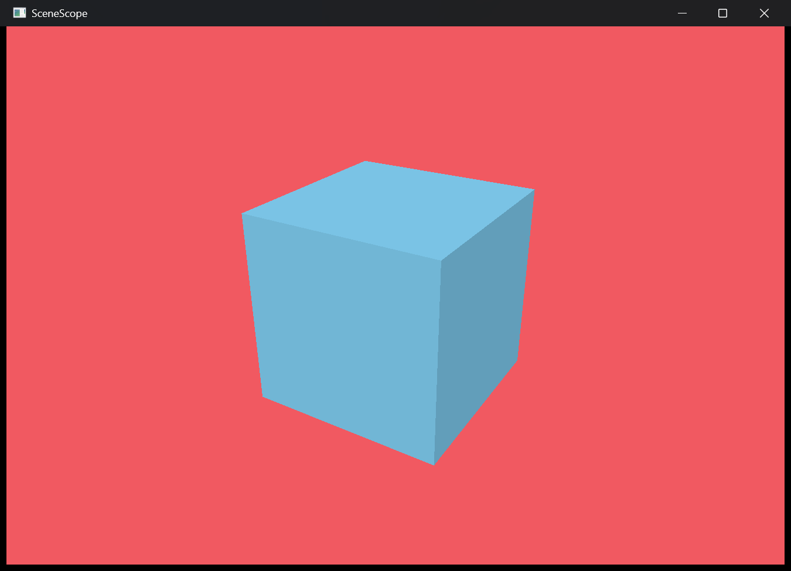

# SceneScope

> Cross-platform 3D asset inspection and validation.

基于 Rust 与 wgpu 的跨平台 3D 资产检查和验证工具。

**产品边界：SceneScope 检查资产，但不创作资产。**

## 当前状态

项目处于 **M2：从查看器到检查器**。M1 已完成固定 `Box.glb` 的解析、节点变换、Windows/Web 共享渲染、深度测试、背面剔除和轨道相机。当前任务是建立能够表达 v0.1 范围且不绑定第三方 glTF 类型的内部资产模型与统计。

唯一执行状态记录在[项目路线图](docs/roadmap.md)中。



## 快速开始

前置条件：Rust 1.87 或更高版本。

### Windows 桌面端

```powershell
cargo run -p scenescope-desktop
```

程序会加载仓库固定的 `assets/test/Box.glb`。按住鼠标左键拖动可环绕模型，使用滚轮缩放。

### Web 端

首次构建需要安装 `wasm32-unknown-unknown` target 和 `wasm-pack`。完成前置安装后执行：

```powershell
wasm-pack build apps/web --target web --dev
python -m http.server 8080 --directory apps/web
```

然后访问 <http://127.0.0.1:8080/>。Web 端与桌面端使用同一份 `MeshInstance`、渲染器和相机逻辑。

## 当前能力

- 从 GLB 字节读取默认场景中的首个静态 indexed triangle primitive。
- 提取 `POSITION`、可选 `NORMAL`、`u32` 索引和首个 mesh 节点的层级变换。
- 使用共享 `wgpu` 渲染器在 Windows 与 Web 中显示固定 `Box.glb`。
- 支持深度测试、背面剔除、Lambert 漫反射、轨道相机和滚轮缩放。
- 使用 sRGB Surface View 保持桌面端与 Web 端的颜色输出语义一致。
- 自动化测试验证 Box 的 24 个顶点、36 个索引、法线和世界变换。

## 开发检查

日常开发检查会报告警告，但不会因普通 warning 中断：

```powershell
cargo check --workspace --all-targets
cargo clippy --workspace --all-targets --all-features
cargo test --workspace --all-targets
```

release 使用严格门禁。非 debug 构建会自动将所有 rustc warning 升级为 error；`release-check` 还会以 release 配置运行全量 Clippy，并把所有 Clippy warning 当作错误：

```powershell
cargo fmt --all --check
cargo release-check
cargo test --workspace --all-targets --release
cargo build --workspace --release
cargo doc --workspace --all-features --no-deps --release
```

新增 workspace crate 时必须同时：在该 crate 的 `Cargo.toml` 加入 `[lints] workspace = true`，并在 crate 根加入 `#![cfg_attr(not(debug_assertions), deny(warnings))]`。稳定版 Cargo 暂不支持按 profile 配置 `rustflags`，因此这两处不能省略。

## Workspace

```text
crates/scenescope-core    # 平台无关的内部场景数据
crates/scenescope-gltf    # GLB/glTF 适配与内部模型转换
crates/scenescope-render  # Windows/Web 共用的 wgpu 渲染器
apps/desktop              # Windows 原生入口与输入事件
apps/web                  # WebAssembly 入口与浏览器事件生命周期
assets/test               # 固定公开回归资产及许可记录
docs                      # 产品、路线图、架构、ADR 和调试记录
```

依赖边界和后续目录见[架构设计](docs/architecture.md)。项目只在出现真实消费者时增加 crate。

## v0.1 范围

- 输入单个 `.glb`，支持静态网格、索引、节点 TRS、`POSITION`、`NORMAL`、`TEXCOORD_0` 和 Base Color 纹理。
- 在 Windows 与浏览器中提供一致的场景数据和检查结果。
- 提供场景摘要、确定性规则诊断和 CLI JSON 报告。
- 首批规则：纹理尺寸、三角形预算、缺少法线、材质预算、不支持扩展。

## v0.1 不做

资产编辑/保存、格式转换、多模型格式、动画/骨骼/Morph Target/物理、Draco/KTX2、完整 PBR/阴影/后处理、ECS/完整引擎、动态插件、云端系统和主机平台均不在本期范围。

完整范围、异常语义和验收标准见[产品规格](docs/product.md)。

## 测试资产

`assets/test/Box.glb` 来自 Khronos Group 的 glTF Sample Assets，原作者/权利方为 Cesium（2017），按 CC-BY-4.0 使用。固定提交、下载地址、哈希和完整归属记录见 [资产说明](assets/test/README.md)。

## 当前限制

- 当前入口只加载内嵌的 `Box.glb`，尚未支持本地文件选择。
- 只解析默认场景（或首个场景）的首个 mesh 节点和首个 indexed triangle primitive。
- 尚未读取 UV、材质、Base Color 纹理、多个 mesh 或完整节点树。
- 尚无场景摘要 UI、资产统计界面、检查规则、CLI 或 JSON 报告。
- 不支持动画、蒙皮、Morph Target、Draco、KTX2 或外部 buffer。
- 当前只验证了 Windows 桌面端和浏览器中的 WebAssembly 构建与运行，不能据此声称其他平台已受支持。

## 已知问题

- 当前固定方向光会让背向光源的一侧明显变暗，这不是背面剔除错误。
- Windows 入口目前使用持续重绘，静止时仍会占用额外 CPU/GPU 时间。
- 加载或 GPU 初始化失败时尚无用户界面，Web 端错误只写入浏览器控制台。

## 文档索引

- [产品规格](docs/product.md)
- [项目路线图](docs/roadmap.md)
- [架构设计](docs/architecture.md)
- [ADR-0001：项目基线](docs/adr/0001-project-foundation.md)
- [ADR-0002：跨平台颜色输出](docs/adr/0002-cross-platform-color-output.md)
- [调试记录：Desktop/Web 色差](docs/debugging/0001-desktop-web-color-difference.md)
